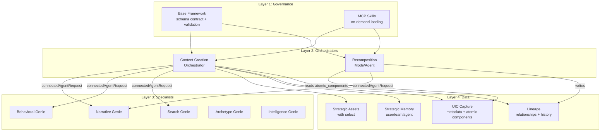
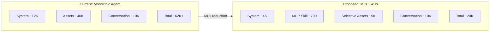
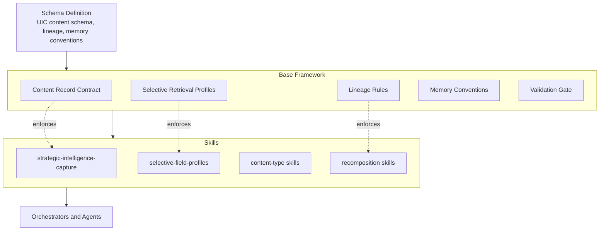
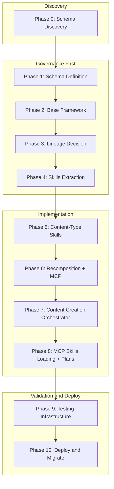
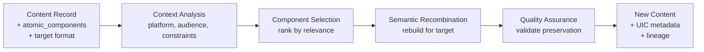

# StoryCycle Genie V2: Executable Vision

*The single reference for building the next version of StoryCycle Genie—token-optimized, governance-first, with full Ultra-Intelligent Content and Cognitive Mesh Architecture in one iteration.*

---

## Executive Summary

**Goal:** Dramatically reduce token usage (80-85% per session), eliminate redundancy, and deliver the complete Ultra-Intelligent Content (UIC) and Cognitive Mesh Architecture (CMA) vision in a single iteration.

**Approach:**
1. Extract optimized base framework with schema and data architecture baked into governance
2. Create reusable skills architecture (tier 1-4 + content-types) loaded via MCP
3. Implement selective field retrieval for strategic assets
4. Consolidate 13 content creation agents into 1 orchestrator + content-type skills
5. Add UIC capture at creation (metadata + atomic components) and recomposition workflow
6. Integrate strategic memory with creation/retrieval triggers
7. Track cross-asset relationships and lineage for compound intelligence

**Expected Outcomes:**

| Metric | Current | Target | Improvement |
|--------|---------|--------|-------------|
| Base Framework | 76K tokens | 8-10K | 87% reduction |
| Strategic Assets | 43K tokens | 5K | 88% reduction |
| Content Agents (13) | 152K tokens | 15K | 90% reduction |
| Typical Session | 130K+ tokens | 20-25K | 80-85% reduction |
| Content Types | 13 agents | 1 orchestrator + skills | 92% code reduction |

**Test Strategy:** All validation via StoryCycle MCP in Cursor (proxy to Brightsy with full tool access).

---

## Principles

### 1. Governance First

Schemas and data architecture are part of the **governance layer** (Framework Governance pillar). They must be defined and baked into the base framework and skills *before* implementing agents, so every agent enforces the same data contract by design—not as a bolt-on.

### 2. CMA Four Pillars

All four Cognitive Mesh Architecture pillars must be operational:

| Pillar | Implementation |
|--------|----------------|
| **Framework Governance** | Base framework + skills encode schemas, selective retrieval profiles, lineage rules, memory conventions, validation gate |
| **Collective Intelligence** | Strategic assets + UIC metadata + atomic components + cross-asset relationships compound over time |
| **Intelligent Orchestration** | Content Creation Orchestrator + Recomposition + specialists via connectedAgentRequest + Brightsy Plans for complex agents |
| **Embedded Intelligence** | Specialists (Narrative, Behavioral, Search) + skills carry domain expertise |

### 3. Test via StoryCycle MCP

All testing happens in Cursor via StoryCycle MCP—proxy to Brightsy with full tool access. No production changes until validated.

---

## Unified Architecture

### System Architecture (Layers)



### Token Flow Comparison



---

## Governance Layer (Schema and Data)

### Governance and Schema Flow



**Key principle:** No agent runs without the contract already in base + skills; skills enforce the contract.

### What Lives in the Base Framework (storycycle-base-optimized.md)

| Governance Element | Description |
|--------------------|-------------|
| **Canonical schema references** | Where to find UIC content schema, atomic component shape, two-tier (core vs extended) rules |
| **Content record contract** | Every content record MUST include: `ultra_intelligent_metadata` (creation_context, strategic_intelligence_preservation, atomic_components) and lineage fields (`intelligence_assets_referenced` or `derived_from_assets`) |
| **Selective retrieval profiles** | Which `select` fields to use for Brand Story (~2K vs 15K), Playbook (~2K vs 20K), Audience Story (~1K vs 8K) |
| **Lineage and relationship rules** | On create: set `intelligence_assets_referenced` / `derived_from_assets`. On recompose: set `recomposed_from_content_id` and append `adaptation_history` |
| **Memory conventions** | Canonical memory names/levels (e.g. `cma.primary_brand_story_id`, `cma.preference.workflow_mode`) and creation/retrieval triggers |
| **Validation gate** | Before any content save: "Does this payload satisfy the content record contract?" If not, do not persist |

### What Lives in Skills

| Skill Type | Schema/Data Responsibility |
|------------|----------------------------|
| **strategic-intelligence-capture** (tier-3) | How to build `ultra_intelligent_metadata` and `atomic_components` from context and generated content; required fields and shapes; validation before save |
| **selective-field-profiles** (tier-3) | Governance-approved `select` lists per strategic asset type—no ad-hoc `select` |
| **Content-type skills** (e.g. blog-post, email-core) | Which atomic component types this type produces (e.g. key_insight, proof_element, cta); type-specific validation; conform to content record contract |
| **Recomposition skills** | How to read `atomic_components` and `strategic_intelligence_preservation`; how to write `recomposed_from_content_id` and `adaptation_history` on output |

### UIC Content Schema Summary (Brightsy Two-Tier)

**Tier 1 — Core (in record.data):**

| Field | Purpose |
|-------|---------|
| `ultra_intelligent_metadata.creation_context` | originating_agent, coordinating_agents, intelligence_assets_referenced |
| `ultra_intelligent_metadata.strategic_intelligence_preservation` | brand_positioning_elements, content_strategy_alignment, semantic_meaning_markers |
| `ultra_intelligent_metadata.atomic_components` | Array of { component_type, content, semantic_tags, recomposition_constraints, adaptation_contexts } (top 5-15 per content) |
| `multi_agent_coordination_data.coordinating_agent_roles` | Snapshot of which specialists participated |
| `derived_from_assets` | Array of asset IDs this content was created from |
| `recomposed_from_content_id` | ID of source content (if recomposed) |
| `adaptation_history` | Array of { target_format, date, preservation_score } |

**Tier 2 — Extended (optional separate record or deeply nested):**

- Detailed adaptation rules per component
- Full relationship map (derives_from, supports_components)

---

## Single Phased Implementation

### Phase Execution Order



---

### Phase 0: Schema Discovery (Pre-Work) ✅ COMPLETE

**Goal:** Audit existing Brightsy record_types to understand what fields exist on each asset type before defining governance schemas.

**Why this matters:** We cannot define selective retrieval profiles or content record contracts without knowing what fields actually exist. This discovery step ensures governance is grounded in reality, not assumptions.

**Primary Source:** [storycycle-record-types-summary.md](storycycle-record-types-summary.md) — **All 38 StoryCycle record types now fully documented** (as of 2026-02-03).

#### All Schemas Now Documented

| Category | Record Types | Has strategic_intelligence |
|----------|--------------|---------------------------|
| **Foundation Strategy** | Brand Story, Audience Story, ABT Statement, Content Playbook, Author Voice Profile, Brand Intelligence Report, Social Media Strategy, Content Marketing Strategy, Customer Journey, Narrative Arc, Persona, Story | ✓ (all) |
| **Quality/Assessment** | Strategic Asset Score, Brand Story Assessment, Brand Story Grade | ✓ |
| **Content Output** | Content Asset, Social Media Post, Website Content, Testimonial | ✓ |
| **Planning** | Campaign, Content Calendar, Content Enhancement | ✓ |
| **Agent System** | Agent Metadata, Agent Analysis, Brand-Native Expert | ✓ |
| **User Data** | User Content Preferences | ✓ |
| **Email Operations** | Email Campaigns, Email Subscribers, Email Templates, Resend Templates, Sending Domains | — |
| **Infrastructure** | Webhook Events | — |

**Shared pattern:** `strategic_intelligence` object exists across 30+ types with: depth, risks, pivots, decisions, tradeoffs, captured_at, completeness, agent_context, specialist_insights, etc.

#### Key Schema Insights for CMA Implementation

**What's already there:**
- `strategic_intelligence` is ubiquitous — provides consistent metadata pattern
- ABT framework deeply integrated (and/but/therefore across multiple schemas)
- Story Cycle System native to Content Playbook and Story schemas
- Section-aware content exists in Content Asset (`content_sections`, `intelligent_structure`)
- Scoring framework exists via Strategic Asset Score with defined component weights
- Cross-references exist via embedded objects/arrays

**What's missing for full CMA:**
- Graph relationships (no `asset_relationships` table)
- Section-level embeddings (sections are in JSONB, not independently searchable)
- Coherence scores on assets (scores are separate records)
- Lineage tracking (`derived_from_assets`, `recomposed_from_content_id`)
- Memory conventions (app-level, not in schema)

#### Output Schema Definition (New Work)

This is **not** discovery—it's **definition** of what we're creating:

| Content Type | Atomic Component Types | Recomposition Use |
|--------------|------------------------|-------------------|
| **Blog Post** | key_insight, proof_element, cta, headline, subhead, pull_quote | → social, email, slides |
| **Video Script** | hook, scene, transition, cta, timing_cue, b_roll_note | → short-form, social clips |
| **Case Study** | challenge, solution, result, client_quote, metric | → testimonials, proof points |
| **Email** | subject_line, hook, body_insight, cta, ps_line | → across sequences |
| **Presentation** | slide_headline, key_point, supporting_data, speaker_note | → docs, summaries |
| **Press Release** | headline, lead, quote, boilerplate, call_to_action | → social, blog |
| **Longform** | chapter_summary, key_insight, proof_element, callout, cta | → blog series, social |
| **Webinar** | segment_summary, key_takeaway, interactive_prompt, cta | → blog, email |

#### Deliverables

**Schema Discovery (Complete):**
- [x] All 38 record type schemas documented in storycycle-record-types-summary.md
- [x] CMA gaps identified
- [x] Selective retrieval opportunities identified (essential/optional/excludable guidance in summary)

**Still needed for Phase 1:**
- [ ] **Selective retrieval profiles** — Finalize `select` field lists per input asset type
- [ ] **Output atomic component registry** — Finalize component types per content type (table above is starting point)

---

### Phase 1: Schema and Data Architecture

**Goal:** Define the canonical schemas that governance will encode, based on Phase 0 discovery.

**Inputs from Phase 0:**
- Input schema inventory (what fields exist on strategic assets)
- Selective retrieval candidates (which fields to include/exclude)
- Output schema draft (atomic component types per content type)

**Deliverables:**
- [ ] **UIC content schema doc** — Core fields (`ultra_intelligent_metadata`, `atomic_components`, lineage), two-tier split for Brightsy, based on Content Asset record type from Phase 0
- [ ] **Selective retrieval profiles** — Finalized `select` field lists per input asset type, based on Phase 0 candidates
- [ ] **Atomic component registry** — Canonical list of component types (key_insight, proof_element, cta, etc.) with definitions, based on Phase 0 output schema draft
- [ ] **Lineage/relationship decision** — Embedded vs record type
- [ ] **Memory conventions doc** — Names, levels, triggers

**Output:** Schema appendix or one-page spec referenced by base framework, grounded in actual Brightsy schemas.

---

### Phase 2: Base Framework Extraction

**Goal:** Extract base (~8-10K tokens) from source modules AND add governance sections.

**Source modules to extract from:**
- `1-framework-core.md` — Execution, voice, UI
- `6-record-management-framework.md` — Records, search
- `9-ui-guidelines.md` — UI components
- `11-compliance.md` — State management

**Extract to base (universal):**
- Pre-response validation, user agency preservation
- State management structure
- Voice system basics (Park Howell/Professional)
- Brand identification protocol, asset type registry
- UI component basics
- Streaming UI patterns
- Progressive loading directives
- Inter-agent response protocol (CRAFT-inspired, ~200 tokens)

**Add governance sections:**
- Content record contract (from Phase 1 schema)
- Selective retrieval profiles (from Phase 1)
- Lineage and relationship rules (from Phase 1)
- Memory conventions with creation/retrieval triggers (from Phase 1)
- Validation gate

**Deliverables:**
- [ ] `framework/storycycle-base-optimized.md` (~8-10K tokens)
- [ ] `framework/progressive-loading-map.md` (when to load what)

---

### Phase 3: Lineage/Relationship Decision

**Goal:** Finalize how relationships and lineage are stored.

**Options:**
- **Option A — Separate record type:** `source_asset_id`, `target_asset_id`, `relationship_type`, optional `strength`
- **Option B — Embedded fields:** `derived_from_assets`, `recomposed_from_content_id`, `adaptation_history` on content records

**Recommendation:** Option B for v1 (minimal, often enough).

**Deliverables:**
- [ ] Decision documented in schema doc
- [ ] Write rules in base framework (lineage rules section)

---

### Phase 4: Skills Extraction (Tier 1-4)

**Goal:** Extract reusable skills with governance enforcement.

#### Tier-1 Core Skills (~200 tokens each)
| Skill | Content |
|-------|---------|
| `brand-identification.md` | Detection patterns, search, confirmation UI |
| `framework-compliance.md` | Pre-response validation checklist |
| `navigation-standards.md` | No dead-ends, show_buttons patterns |

#### Tier-2 Specialist Skills (~300 tokens each)
| Skill | Content |
|-------|---------|
| `narrative-structure.md` | ABT formula, Story Cycle integration |
| `archetype-analysis.md` | Selection process, brand infusion |
| `behavioral-enhancement.md` | Silent enhancement, triggers |
| `search-optimization.md` | SEO patterns, discovery |

#### Tier-3 Workflow Skills (~200 tokens each)
| Skill | Content |
|-------|---------|
| `strategic-asset-discovery.md` | 5-step search, priority order |
| `selective-field-profiles.md` | Governance-approved field lists per asset type |
| `specialist-integration.md` | When/how to delegate |
| `dual-process-selection.md` | StoryCyclone vs step-by-step + confidence thresholds |
| `checkpoint-enforcement.md` | Progress validation |
| `strategic-intelligence-capture.md` | UIC metadata + atomic components extraction |

**Confidence thresholds (dual-process-selection):**
| Confidence | Behavior |
|------------|----------|
| 0.95+ | Full automation, no user approval needed |
| 0.85-0.94 | Auto-execute, present result for approval |
| 0.70-0.84 | Present options, recommend one |
| <0.70 | Step-by-step guided workflow |

#### Tier-4 Utility Skills (~150 tokens each)
| Skill | Content |
|-------|---------|
| `pdf-generation.md` | Template selection, generation |
| `content-approval.md` | Approval UI, save workflow |

**Deliverables:**
- [ ] 3 tier-1-core skills
- [ ] 4 tier-2-specialists skills
- [ ] 6 tier-3-workflows skills (including updated strategic-intelligence-capture)
- [ ] 2 tier-4-utilities skills
- [ ] skills/README.md documentation

---

### Phase 5: Content-Type Skills

**Goal:** Create simple + composable content-type skills, each conforming to content record contract AND defining atomic component types for UIC capture.

**Critical requirement:** Each content-type skill MUST define which atomic component types it produces. This is how the schema (Phase 1) becomes enforceable per content type.

#### Atomic Component Types per Content Type (from Phase 0/1)

| Content Type | Atomic Components | Purpose |
|--------------|-------------------|---------|
| **blog-post** | `key_insight`, `proof_element`, `cta`, `headline`, `subhead`, `pull_quote` | Recompose to social, email, slides |
| **video-script** | `hook`, `scene`, `transition`, `cta`, `timing_cue`, `b_roll_note` | Recompose to short-form, social clips |
| **case-study** | `challenge`, `solution`, `result`, `client_quote`, `metric` | Recompose to testimonials, proof points |
| **email** | `subject_line`, `hook`, `body_insight`, `cta`, `ps_line` | Recompose across sequences |
| **presentation** | `slide_headline`, `key_point`, `supporting_data`, `speaker_note` | Recompose to docs, summaries |
| **press-release** | `headline`, `lead`, `quote`, `boilerplate`, `call_to_action` | Recompose to social, blog |
| **longform** | `chapter_summary`, `key_insight`, `proof_element`, `callout`, `cta` | Recompose to blog series, social |
| **webinar** | `segment_summary`, `key_takeaway`, `interactive_prompt`, `cta` | Recompose to blog, email |

Each content-type skill must include a **## Atomic Components** section that defines:
1. Which component types this content produces
2. How to extract each component from generated content
3. Semantic tags and recomposition constraints per component

#### Simple Content Types (single skill each, ~150-200 lines)
- blog-post.md
- case-study.md
- press-release.md
- one-pager.md
- product-description.md
- sales-email.md
- substack.md
- documentation.md

#### Composable Content Types (core + variants)

**Email (~1K tokens total):**
```
skills/content-types/email/
├── email-core.md           (~300 lines)
├── email-product-led.md    (~400 lines)
└── email-relationship.md   (~350 lines)
```

**Video (~900 tokens total):**
```
skills/content-types/video/
├── video-core.md           (~250 lines)
├── video-short-form.md     (~200 lines)
├── video-long-form.md      (~250 lines)
└── video-professional.md   (~200 lines)
```

**Longform (~1K tokens total):**
```
skills/content-types/longform/
├── longform-core.md        (~250 lines)
├── longform-whitepaper.md  (~300 lines)
├── longform-ebook.md       (~250 lines)
└── longform-research.md    (~250 lines)
```

**Presentation (~750 tokens total):**
```
skills/content-types/presentation/
├── presentation-core.md    (~300 lines)
├── presentation-sales.md   (~250 lines)
└── presentation-investor.md (~200 lines)
```

**Webinar (~700 tokens total):**
```
skills/content-types/webinar/
├── webinar-core.md         (~300 lines)
├── webinar-leadgen.md      (~200 lines)
└── webinar-educational.md  (~200 lines)
```

#### Non-Content Composable Skills

**Brand Story:**
```
skills/brand-story/
├── brand-core.md    (~300 lines)
├── brand-b2b.md     (~250 lines)
├── brand-b2c.md     (~250 lines)
└── brand-service.md (~200 lines)
```

**Voice Discovery:**
```
skills/voice-discovery/
├── voice-core.md            (~250 lines)
├── voice-sample-analysis.md (~300 lines)
└── voice-interview.md       (~250 lines)
```

**Search Optimization:**
```
skills/search-optimization/
├── search-core.md     (~300 lines)
├── search-web-seo.md  (~400 lines)
├── search-ai-geo.md   (~350 lines)
├── search-voice.md    (~250 lines)
└── search-visual.md   (~250 lines)
```

**Deliverables:**
- [ ] 8 simple content-type skills
- [ ] 5 composable content-type directories (17 skills)
- [ ] 3 non-content composable directories (12 skills)
- [ ] Each skill specifies atomic component types and conforms to content record contract

---

### Phase 6: Recomposition Skills + MCP

**Goal:** Support "recompose this content for [new format/context]" using stored atomic components.

### Recomposition Flow



**Recomposition Skills (~150-250 lines each):**
- `recomposition-context-analysis.md`
- `recomposition-component-selection.md`
- `recomposition-semantic-recombination.md`
- `recomposition-qa.md`

**MCP Tools:**
- `get_atomic_components(record_id)` — Returns `ultra_intelligent_metadata.atomic_components`
- `recompose_content(record_id, target_format, context)` — Triggers recomposition flow or returns components + constraints

**Implementation Options:**
- **Option A:** New `content-recomposition-orchestrator.md` agent (~4K tokens)
- **Option B:** Recomposition mode in Content Creation Orchestrator

**Deliverables:**
- [ ] 4 recomposition skills
- [ ] MCP tools: `get_atomic_components`, `recompose_content`
- [ ] Recomposition orchestrator or mode
- [ ] Test scenario: blog → 3 social posts

---

### Phase 7: Content Creation Orchestrator

**Goal:** Replace 13 content agents with 1 orchestrator + skills.

**File:** `agents/content-creation-orchestrator.md` (~4-5K tokens)

**Core Structure:**
```markdown
# Content Creation Orchestrator v1.0

## Framework Reference
Base: storycycle-base-optimized.md

## Identity
Unified agent that creates all marketing content using StoryCycle System and ABT.

## Progressive Loading Protocol
| Step | Action | Load |
|------|--------|------|
| 1 | Start | Base framework (already loaded) |
| 2 | Brand ID | tier-1-core/brand-identification.md |
| 3 | Assets | tier-3-workflows/strategic-asset-discovery.md |
| 4 | Type Selection | Present content type options |
| 5 | Type Selected | content-types/{selected}.md |
| 6 | Creation | tier-2-specialists/specialist-delegation.md |
| 7 | UIC Capture | tier-3-workflows/strategic-intelligence-capture.md |
| 8 | Save | Write with lineage |
| 9 | Approve | tier-4-utilities/content-approval.md |

## Specialist Delegation IDs
- Narrative: f68f1a8c-731a-4c9f-80f2-4cc044b8c69e
- Behavioral: 92160ed0-bdfe-4c44-98ca-6f272a61c8de
- Search: 4e862e8c-46b0-43e7-a2b8-b077afd0a934
- Archetype: bc86a313-61fd-4303-9505-7a34b6496e8b
- Intelligence: b401985b-61b3-4017-bd2c-371ad7e4dfdf

## Content Type Detection
[Pattern matching for 13 content types]

## Before Save: UIC Capture + Lineage
- Run strategic-intelligence-capture
- Set derived_from_assets from context
- Validate against content record contract
```

**Deliverables:**
- [ ] `agents/content-creation-orchestrator.md`
- [ ] Content type detection logic
- [ ] UIC capture before save
- [ ] Lineage write on create
- [ ] Optional: Recomposition mode

---

### Phase 8: MCP Skills Loading + Brightsy Plans

**Goal:** Implement MCP tools for skills loading and use Plans for complex agents.

**MCP Skills Loading Tools:**

```typescript
// Get single skill
mcp_storycycle_get_skill({
  skill_name: "blog-post",
  include_dependencies: true,
  context: { business_model: "b2b_saas" }
})

// Get composable skill set
mcp_storycycle_get_skill_set({
  content_type: "email",
  context: { business_model: "b2b_saas" }
})

// Detect and load
mcp_storycycle_detect_and_load({
  user_request: "Create a sales email sequence",
  brand_id: "abc-123"
})

// Plan-aware loading
mcp_storycycle_get_phase_skills({
  plan_id: "abc-123",
  task_id: "phase-2"
})
```

**Brightsy Plans for Complex Agents:**

| Agent | Complexity | Use Plans |
|-------|------------|-----------|
| Brand Genius Genie | 7/7 | Yes |
| Customer Journey Strategy | 7/7 | Yes |
| Web Copywriter Genie | 7/7 | Yes |
| BrandStory Grader | 6/7 | Yes |

**Plan Benefits:**
- Checkpoint recovery (pause after Phase 2, resume tomorrow)
- No timeouts (each phase executes independently)
- Visibility (user sees progress, can modify)
- Context management (each phase loads only required skills)

**Deliverables:**
- [ ] MCP: `get_skill`, `get_skill_set`, `detect_and_load`, `get_phase_skills`
- [ ] Plan templates for 4 complex agents
- [ ] Phase decomposition skills for each complex agent

---

### Phase 9: Testing Infrastructure

**Goal:** Validate all components before deployment.

**Test Files:**
- `testing/token-counter.py` — Multi-model token counting
- `testing/quality-grader.md` — 8-dimension quality rubric
- `testing/test-scenarios.md` — Standardized test cases

**Test Types:**

| Test Type | What It Validates |
|-----------|-------------------|
| Token Counting | Reduction math is correct |
| Skills Loading | Files load on-demand via MCP |
| Selective Retrieval | `select` property reduces tokens |
| Quality Comparison | Optimized output matches baseline |
| Streaming UI | `show_buttons` works, no blocking |
| UIC Schema | Content records include `ultra_intelligent_metadata` |
| Recomposition | blog → social works with strategic preservation |
| Memory Triggers | Creation/retrieval triggers fire correctly |
| End-to-End | Complete workflows function |

**Go/No-Go Criteria:**

| Criterion | Target |
|-----------|--------|
| Skills loading | Works reliably |
| Selective retrieval | Works correctly |
| Token reduction | ≥60% |
| Quality parity | ≥95% |
| UIC schema validation | All new content has metadata |
| At least 1 recomposition path | Works end-to-end |

**Deliverables:**
- [ ] Testing infrastructure files
- [ ] Baseline measurements
- [ ] Go/no-go decision documented

---

### Phase 10: Deploy and Migrate

**Goal:** Deploy all components and migrate from old agents.

**Deploy Order:**
1. Base framework with governance
2. All skills (tier 1-4 + content-types + recomposition)
3. MCP tools
4. Content Creation Orchestrator
5. Brightsy Plans for complex agents
6. Update app-config

**Config Updates:**
- `app-config/agent-list-array.txt` — Remove 13, add 1 orchestrator
- `app-config/agent-descriptions.md` — Update descriptions

**Archive (don't delete):**
- `agents/content-creation-agents/*.md` (13 files)
- `framework/storycycle-framework-optimized-v3.md`
- `framework/strategic-intelligence-*.md`

**Deliverables:**
- [ ] All components deployed to Brightsy
- [ ] app-config updated
- [ ] Original agents archived
- [ ] Rollback plan documented

---

## Directory Structure

```
storycycle-assets/
├── framework/
│   ├── storycycle-base-optimized.md      # NEW: Compressed base (~8-10K)
│   ├── progressive-loading-map.md        # NEW: When to load what
│   ├── uic-content-schema.md             # NEW: UIC schema spec
│   └── [source modules - for edge cases]
│
├── skills/
│   ├── README.md
│   │
│   ├── tier-1-core/
│   │   ├── brand-identification.md
│   │   ├── framework-compliance.md
│   │   └── navigation-standards.md
│   │
│   ├── tier-2-specialists/
│   │   ├── narrative-structure.md
│   │   ├── archetype-analysis.md
│   │   ├── behavioral-enhancement.md
│   │   └── search-optimization.md
│   │
│   ├── tier-3-workflows/
│   │   ├── strategic-asset-discovery.md
│   │   ├── selective-field-profiles.md
│   │   ├── specialist-integration.md
│   │   ├── dual-process-selection.md
│   │   ├── checkpoint-enforcement.md
│   │   └── strategic-intelligence-capture.md
│   │
│   ├── tier-4-utilities/
│   │   ├── pdf-generation.md
│   │   └── content-approval.md
│   │
│   ├── content-types/
│   │   ├── blog-post.md
│   │   ├── case-study.md
│   │   ├── press-release.md
│   │   ├── one-pager.md
│   │   ├── product-description.md
│   │   ├── sales-email.md
│   │   ├── substack.md
│   │   ├── documentation.md
│   │   ├── email/
│   │   ├── video/
│   │   ├── longform/
│   │   ├── presentation/
│   │   └── webinar/
│   │
│   ├── brand-story/
│   ├── voice-discovery/
│   ├── search-optimization/
│   │
│   └── recomposition/
│       ├── context-analysis.md
│       ├── component-selection.md
│       ├── semantic-recombination.md
│       └── qa.md
│
├── agents/
│   ├── content-creation-orchestrator.md   # NEW: Replaces 13 agents
│   └── [other optimized agents]
│
├── testing/
│   ├── token-counter.py
│   ├── quality-grader.md
│   ├── test-scenarios.md
│   └── results/
│
└── archive/
    └── content-creation-agents/           # Original 13 agents
```

---

## MCP and Brightsy

### StoryCycle MCP Tools

**Skills Loading:**
| Tool | Purpose |
|------|---------|
| `get_skill(skill_name, include_dependencies, context)` | Load single skill with optional dependencies |
| `get_skill_set(content_type, context)` | Load composable skill set based on context |
| `detect_and_load(user_request, brand_id)` | Auto-detect content type and return skills |
| `get_phase_skills(plan_id, task_id)` | Plan-aware skill loading |

**UIC/Recomposition:**
| Tool | Purpose |
|------|---------|
| `get_atomic_components(record_id)` | Return atomic_components from content record |
| `recompose_content(record_id, target_format, context)` | Trigger recomposition or return components |

**Optional:**
| Tool | Purpose |
|------|---------|
| `list_asset_relationships(record_id)` | Return derived_from, supports, etc. |
| `get_content_lineage(record_id)` | Return chain: source → content → children |

### Brightsy Plans

**For Complex Agents:**
```javascript
create_plan({
  title: "Customer Journey Strategy: [Brand]",
  status: "awaiting_approval",
  todos: [
    { id: "phase-1", content: "Discovery", skills_required: ["journey-core"], dependencies: [] },
    { id: "phase-2", content: "Mapping", skills_required: ["journey-narrative"], dependencies: ["phase-1"] },
    { id: "phase-3", content: "Content Strategy", skills_required: ["journey-content"], dependencies: ["phase-2"] },
    { id: "phase-4", content: "Implementation", skills_required: ["journey-checkpoint"], dependencies: ["phase-3"] }
  ]
})
```

---

## Testing Strategy

### Test Categories

| Category | Tests | Pass Criteria |
|----------|-------|---------------|
| **Token Counting** | Measure base, skills, session totals | ≥60% reduction |
| **Skills Loading** | All skills load via MCP | 100% success |
| **Selective Retrieval** | `select` returns correct fields | Correct fields, reduced tokens |
| **Quality Parity** | Compare optimized vs baseline outputs | ≥95% quality |
| **UIC Schema** | New content has `ultra_intelligent_metadata` | All fields present |
| **Recomposition** | blog → social posts | Strategic preservation |
| **Memory** | Triggers fire on create/retrieve | At least 2 each |
| **Streaming UI** | `show_buttons` works | No blocking |
| **End-to-End** | Complete content creation workflow | Full success |

### Test Process

1. **Baseline:** Measure current agents (tokens, quality)
2. **Unit:** Test each skill independently
3. **Integration:** Test skills compose correctly
4. **Quality:** Compare outputs using 8-dimension rubric
5. **Regression:** Ensure no quality loss
6. **Go/No-Go:** All criteria must pass

---

## Success Metrics and Risks

### Success Metrics

| Metric | Current | Target | Measurement |
|--------|---------|--------|-------------|
| Base Framework | 76K tokens | 8-10K | 87% reduction |
| Content Agents Codebase | 152K tokens | 15K | 90% reduction |
| Per-Session Tokens | 130K+ | 20-25K | 80% reduction |
| Files to Maintain (Content) | 13 agents | 1 + 52 skills | 50% fewer files |
| Add New Content Type | 800+ lines | 200 lines | 75% less effort |
| Shared Logic Copies | 13 | 1 | 92% reduction |
| Quality Score | Baseline | ≥95% of baseline | Parity maintained |
| UIC Schema Compliance | 0% | 100% | All new content |
| Recomposition Paths | 0 | 1+ | At least blog → social |
| Memory Triggers | 0 | 4+ | 2 create + 2 retrieve |

### Risks and Mitigation

| Risk | Mitigation | Fallback |
|------|------------|----------|
| Skills loading fails | Test thoroughly via MCP before deploy | Inline critical skills |
| Quality regression | Test each type before migration | Keep original agents |
| Content type nuance lost | Preserve ALL unique logic in type skills | Expand type skills |
| Orchestrator complexity | Clear separation of concerns | Split if needed |
| User confusion | Clear content type selection UI | Add guided flow |
| UIC schema too complex | Start with core fields only | Defer extended tier |
| Recomposition quality | Manual QA on first paths | Limit to simple paths |
| Emergency rollback | Archive, don't delete originals | Restore from archive |

---

## Execution Checklist

**Discovery, then Governance First:** Complete Phase 0, then Phases 1-4 before implementing agents.

### Phase 0: Schema Discovery (Pre-Work) ✅ COMPLETE
**Primary source:** [storycycle-record-types-summary.md](storycycle-record-types-summary.md)

**All 38 record type schemas now documented:**
- [x] Foundation Strategy (12 types): Brand Story, Audience Story, ABT Statement, Content Playbook, Author Voice Profile, Brand Intelligence Report, Social Media Strategy, Content Marketing Strategy, Customer Journey, Narrative Arc, Persona, Story
- [x] Quality/Assessment (3 types): Strategic Asset Score, Brand Story Assessment, Brand Story Grade
- [x] Content Output (4 types): Content Asset, Social Media Post, Website Content, Testimonial
- [x] Planning (3 types): Campaign, Content Calendar, Content Enhancement
- [x] Agent System (3 types): Agent Metadata, Agent Analysis, Brand-Native Expert
- [x] User Data (1 type): User Content Preferences
- [x] Email Operations (5 types): Email Campaigns, Email Subscribers, Email Templates, Resend Templates, Sending Domains
- [x] Infrastructure (1 type): Webhook Events
- [x] CMA gaps vs current state documented
- [x] Selective retrieval opportunities identified

### Phase 1: Schema Definition (uses Phase 0 outputs)
- [ ] Define UIC content schema (core fields) based on Content Asset schema
- [ ] Define two-tier split for Brightsy
- [ ] Define selective retrieval profiles based on Phase 0 candidates
- [ ] Finalize atomic component registry (canonical types with definitions)
- [ ] Define lineage/relationship fields
- [ ] Define memory conventions (names, levels, triggers)
- [ ] Create schema doc or appendix

### Phase 2: Base Framework
- [ ] Analyze source modules
- [ ] Extract universal content to base (~8-10K)
- [ ] Add content record contract
- [ ] Add selective retrieval profiles
- [ ] Add lineage rules
- [ ] Add memory conventions
- [ ] Add validation gate
- [ ] Create `storycycle-base-optimized.md`
- [ ] Create `progressive-loading-map.md`

### Phase 3: Lineage Decision
- [ ] Decide embedded vs record type (recommend embedded)
- [ ] Document in schema doc
- [ ] Add write rules to base framework

### Phase 4: Skills Extraction
- [ ] Create 3 tier-1-core skills
- [ ] Create 4 tier-2-specialists skills
- [ ] Create 6 tier-3-workflows skills (with strategic-intelligence-capture)
- [ ] Create 2 tier-4-utilities skills
- [ ] Create skills/README.md
- [ ] Verify all skills reference governance contract

### Phase 5: Content-Type Skills
- [ ] Create 8 simple content-type skills (each with ## Atomic Components section)
- [ ] Create email/ composable (3 skills)
- [ ] Create video/ composable (4 skills)
- [ ] Create longform/ composable (4 skills)
- [ ] Create presentation/ composable (3 skills)
- [ ] Create webinar/ composable (3 skills)
- [ ] Create brand-story/ composable (4 skills)
- [ ] Create voice-discovery/ composable (3 skills)
- [ ] Create search-optimization/ composable (5 skills)
- [ ] Verify each skill defines atomic component types from Phase 1 registry
- [ ] Verify each skill includes extraction logic for its atomic components
- [ ] Verify each skill conforms to content record contract

### Phase 6: Recomposition + MCP
- [ ] Create 4 recomposition skills
- [ ] Implement `get_atomic_components` MCP tool
- [ ] Implement `recompose_content` MCP tool
- [ ] Create recomposition orchestrator/mode
- [ ] Test blog → social recomposition path

### Phase 7: Content Creation Orchestrator
- [ ] Create orchestrator agent (~4-5K)
- [ ] Implement content type detection
- [ ] Implement UIC capture before save
- [ ] Implement lineage write on create
- [ ] Test with 3+ content types

### Phase 8: MCP + Plans
- [ ] Implement `get_skill` MCP tool
- [ ] Implement `get_skill_set` MCP tool
- [ ] Implement `detect_and_load` MCP tool
- [ ] Implement `get_phase_skills` MCP tool
- [ ] Create Plan templates for 4 complex agents
- [ ] Test Plan execution with Brand Genius

### Phase 9: Testing
- [ ] Create testing infrastructure
- [ ] Measure baseline
- [ ] Run token counting tests
- [ ] Run skills loading tests
- [ ] Run quality comparison tests
- [ ] Run UIC schema validation
- [ ] Run recomposition tests
- [ ] Run memory trigger tests
- [ ] Document go/no-go decision

### Phase 10: Deploy
- [ ] Deploy base framework
- [ ] Deploy all skills
- [ ] Deploy MCP tools
- [ ] Deploy orchestrator
- [ ] Deploy Plans
- [ ] Update app-config
- [ ] Archive original agents
- [ ] Verify production functionality
- [ ] Document rollback procedure

---

## References

**CMA and UIC (authoritative):**
- [cma-technical-spec.md](../../spec/cma-technical-spec.md) — Four pillars, Strategic Memory, success indicators
- [ultra-intelligent-content.md](../ultra-intelligent-content/ultra-intelligent-content.md) — UIC definition, recomposition flow
- [ultra-intelligent-content-tech-implementation.md](../ultra-intelligent-content/ultra-intelligent-content-tech-implementation.md) — Semantic schema requirements
- [ultra-intelligent-content-semantic-schema-framework.md](../ultra-intelligent-content/ultra-intelligent-content-semantic-schema-framework.md) — Full schema details, Brightsy two-tier

**Design history (superseded by this doc; archived):**
- [storycycle-genie-token-optimization-plan.md](../../archive/storycycle-genie-token-optimization-plan.md) — Original token optimization plan (archived)
- [storycycle-genie-complete-vision-extension.md](../../archive/storycycle-genie-complete-vision-extension.md) — UIC capture, recomposition, memory, lineage extension (archived)

*This document is the single implementation reference; use the design-history docs only for context or audit.*
