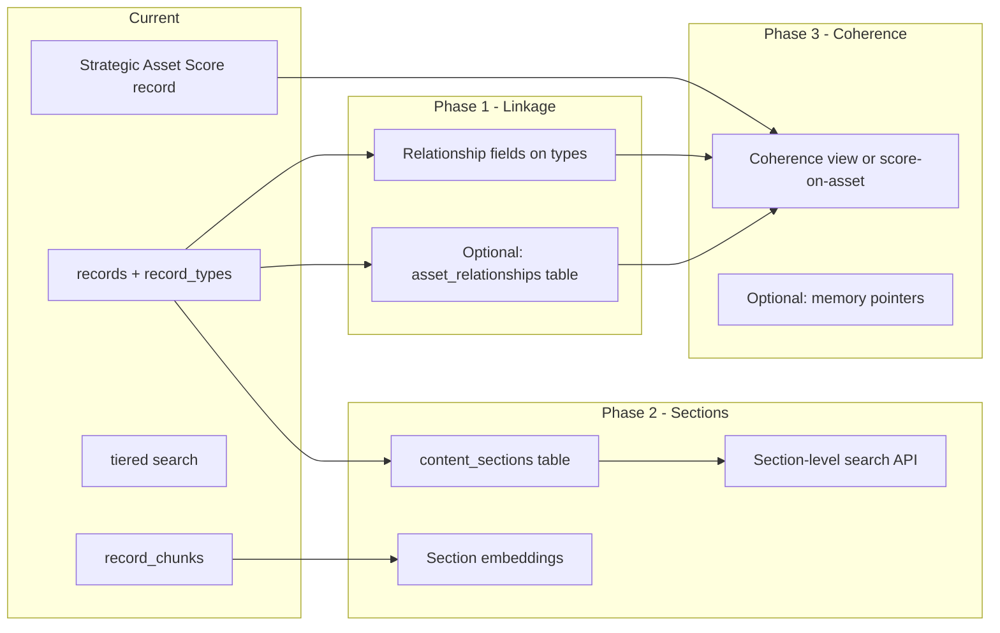

# Cognitive Mesh Architecture (CMA): Authoritative Reference

**Purpose:** Single reference for the collective intelligence ecosystem on Brightsy: what we're trying to do, what exists today (Brightsy + Storycycle), gaps vs the CMA spec, and how to implement.

**Sources:** CMA spec (content-data-architecture.md), Brightsy codebase, Storycycle record types (Supabase project `ukccbetnnemxjrqpamld`), and implementation planning.

*Note: File paths below (e.g. `apps/web/...`, `packages/...`, `docs/features/...`) refer to the **Brightsy** codebase, not this repo.*

---

## 1. What We're Trying to Do

### 1.1 Core question

How do we **persist and retrieve**:

- **Content** – brand stories, audience stories, content strategies, blog posts, whitepapers, social posts, etc.
- **Metadata** – themes, tone, audience, lineage, quality signals.
- **Strategic intelligence** – how pieces relate, how well they align to foundation assets, and how suitable they are for reuse and agentic workflows.

in a way that supports:

- **Agents** that create, edit, and orchestrate content using shared foundational assets (e.g. brand story).
- **Semantic and graph-aware retrieval** – by meaning and by explicit relationships.
- **Quality and coherence** – measurable alignment to strategy and to other high-value assets.
- **Reuse and repurposing** – e.g. sections of long-form content as first-class components.

That's the **collective intelligence ecosystem**: content + metadata + strategic intelligence, stored and queried so humans and agents can use it effectively.

### 1.2 High-level goals

| Goal | Description |
|------|-------------|
| **Unified intelligence storage** | One coherent model for "intelligence assets" (brand story, audience story, strategy, content pieces) with rich, queryable structure. |
| **Graph-aware access** | Explicit relationships between assets (derives_from, references, supports, contradicts) with strength and metadata. |
| **Semantic search** | Find assets by meaning (embeddings) and combine with filters (type, quality, status). |
| **Strategic coherence** | Scores for foundation alignment, cross-asset connectedness, and quality so agents can prefer high-coherence content. |
| **Lightweight context layer** | Memories hold pointers (e.g. `primary_brand_story_id`), thresholds (e.g. `strategic_coherence_minimum`), and preferences; heavy content lives in the DB. |
| **Section-level content** | Long-form = parent asset + ordered sections (each with content, metadata, embedding) for reuse, surgical editing, and section-level semantic search. |
| **Agent-friendly workflows** | Agents initialize from memories + DB; create/update assets; maintain relationships and scores; optionally hand off via events (e.g. Supabase Realtime). |

---

## 2. Three-tier architecture (conceptual)

```
┌─────────────────────────────────────────────────────────────────┐
│  TIER 1: MEMORY LAYER (Brightsy Memories)                       │
│  Lightweight context: preferences, thresholds, optional asset IDs│
└─────────────────────────────────────────────────────────────────┘
                                    ↓
┌─────────────────────────────────────────────────────────────────┐
│  TIER 2: INTELLIGENCE STORAGE (Supabase PostgreSQL + JSONB)     │
│  Full assets: records + record_types (content, semantics, etc.)  │
│  Explicit graph: asset_relationships (to add)                    │
│  Optional: section-based content_sections table (to add)        │
└─────────────────────────────────────────────────────────────────┘
                                    ↓
┌─────────────────────────────────────────────────────────────────┐
│  TIER 3: SEMANTIC LAYER (Cohere Embed + pgvector)               │
│  Embeddings per record (record_chunks) and per section (to add) │
│  Similarity search + optional quality-aware behavior             │
└─────────────────────────────────────────────────────────────────┘
```

- **Tier 1** – Fast, small: what to load, how to behave, what "good" means.
- **Tier 2** – Authoritative: full content, metadata, and (once added) relationship graph.
- **Tier 3** – Retrieval: vector search over embeddings, optionally with coherence/quality filters.

*Schema docs (e.g. Ultra-Intelligent Content semantic framework) may use a two-tier **core vs extended** data pattern within Tier 2 for optimal query performance.*

---

## 3. Data model: CMA spec vs Brightsy/Storycycle reality

### 3.1 CMA spec (proposed)

- **semantic_assets** – Single table: id, asset_type, status; coherence/foundation/cross_asset/quality scores; JSONB content/semantics/lineage/relationships; embedding vector(1024); context/timestamps.
- **asset_relationships** – source_id, target_id, relationship_type, strength [0,1], metadata; unique on (source_id, target_id, relationship_type).
- **content_sections** – parent_asset_id, section_order, section_type, title; content/metadata JSONB; embedding vector(1024).
- **Memory** – Pointers (e.g. primary_brand_story_id), thresholds, standards, preferences.

### 3.2 Brightsy today

- **Records + record_types** – `record_types` (schema, schema_ui, enable_nl_search); `records` (type_id, account_id, data JSONB); RLS by account.
- **record_chunks** – record_id, embedding vector(1536), path; IVFFlat index; used for NL search.
- **record_type_summaries** – Per-type summary + embedding vector(1024); tiered search (summaries first, then records).
- **Cohere Embed** – embed-v4.0, createEmbeddings in RecordsService; dimensions 1024 (summaries) and 1536 (record_chunks).
- **Memories** – memory_resources → memory_items → memory_item_chunks (with embeddings); [RetrievalEngine](apps/web/lib/server/memory/retrieval-engine.ts) (Brightsy) implements category/summary/item tiers for retrieval; remember/retrieve tools. No CMA asset pointers in use today.

### 3.3 Storycycle today (on Brightsy)

- **38 record types** – Foundation-like: Brand Story, Audience Story, ABT Statement, Persona, Content Marketing Strategy, Content Playbook, Social Media Strategy, Customer Journey, Narrative Arc. Derived: Content Asset, Social Media Post, Campaign, Content Enhancement, Website Content, Testimonial, etc. Operational: Email Campaigns, Email Subscribers, Webhook Events, Agent Metadata. See [storycycle-record-types-summary.md](../implementation/storycycle-genie/storycycle-record-types-summary.md) for the full list and schema patterns.
- **Strategic intelligence** – Shared `strategic_intelligence` object on many types: depth, risks, pivots, decisions, tradeoffs, captured_at, completeness, agent_context, user_insights, specialist_insights, etc. Content + metadata + this pattern live in `records.data` by convention.
- **No record-to-record linkage** – All 38 schemas scanned; no has-one/has-many/recordType/foreignKey. Only cross-record "link" is **brand_name** (string). Foundation/related content is embedded (e.g. Brand Story's abt_statements, primary_audiences) or identified by brand name only.
- **Content Asset sections** – Schema has `content_sections`, `intelligent_structure`, `compilation_metadata`, `abt_structure` inside JSONB. Section-aware structure exists in data; no separate `content_sections` table or section-level embeddings.
- **Strategic Asset Score** – Separate record type: asset_id, asset_type, total_score (0–100), calculation_date, calculation_trigger; score_tier; component scores (brand_story_coherence 15%, audience_story_alignment 15%, narrative_structure_quality 10%, reference_network_strength 20%, content_playbook_compliance 10%, professional_intelligence_density 10%, strategic_context_preservation 5%, validation_status_score 10%, implementation_readiness 5%); foundation_analysis, intelligence_analysis, overall_assessment, etc. Coherence is "score record pointing at asset," not columns on the asset.
- **Memory and agents** – No asset IDs in memory; only user/team preferences. Genie/agent loads brand story (and all foundation) from records (e.g. by brand_name or type + filters), not from memory.

---

## 4. Gaps: CMA spec vs current state

| CMA concept | Brightsy/Storycycle today | Gap |
|-------------|---------------------------|-----|
| **Unified semantic_assets table** | Many record types; content + strategic_intelligence in records.data by convention | No single "intelligence asset" table; use records as assets. |
| **Explicit asset_relationships (graph)** | No graph table; only brand_name (string); no relationship_type/strength | Need relationship fields (has-one/has-many) and/or **asset_relationships** table. |
| **Strategic coherence scores** | Strategic Asset Score as separate record (asset_id + component scores) | Pattern exists; optional: materialized view or score columns on assets. |
| **Section-level storage + search** | Content Asset has content_sections/intelligent_structure in JSONB only; no section embeddings | Need **content_sections** table + per-section embeddings + section-level search for complete strategic coherence. |
| **Memory conventions** | No asset IDs in memory; foundation from records only | Optional: document or add memory keys (e.g. primary_brand_story_id) for agent bootstrap. |
| **Vector index** | IVFFlat on record_chunks/summaries | Optional: HNSW for lower latency at scale. |

**Summary:** Metadata and strategic intelligence are already in schemas and data. Main gaps: **graph** (relationship fields and/or asset_relationships table), **section-level table + embeddings + search**, and optional **coherence view / memory conventions**.

### 4.1 Needs, capabilities, implementation (summary)

| Area | Need | Capability today | Implementation |
|------|------|------------------|----------------|
| **Linkage** | Record-to-record links | Only `brand_name`; Brightsy has has-one/has-many | Add relationship fields to types; optionally `asset_relationships` table |
| **Graph** | Typed edges, strength | None | Optional graph table + service + API |
| **Section search** | Section-level coherence | Content Asset has sections in JSONB; no section embeddings | `content_sections` table + embeddings + section search |
| **Coherence** | Scores, alignment | Strategic Asset Score record with asset_id | Keep pattern; optional view/columns; use graph for reference_network |
| **Memory** | Optional asset pointers | Preferences only; foundation from records | Optional memory conventions or keys |

---

## 5. Implementation approach (phased)



### Phase 1: Linkage and graph

- **Relationship fields** – Add has-one (e.g. brand_story_id, audience_story_id) on Content Asset and other derived types using Brightsy's schema (has-one + recordType). Gives record-to-record linkage and simple "this content → this brand story" without new tables.
- **Optional: asset_relationships table** – source_id, target_id → records; relationship_type, strength [0,1], metadata; unique (source_id, target_id, relationship_type). Enables typed graph (derives_from, references, supports) and reference_network_strength. New service + API to create/query edges.
- **Where:** Migrations; RecordsService or new RelationshipService; existing record APIs for fields; new REST/tool for graph if table added.

### Phase 2: Section-level search

- **content_sections table** – parent record id (e.g. records.id), section_order, section_type, title, content snippet, metadata JSONB, embedding vector (align with record_chunks dimension). Populate from Content Asset's records.data.content_sections when intelligent_structure.auto_structured = true (sync or on-demand).
- **Section embeddings** – Cohere + pgvector; index on section embedding.
- **Section-level search** – New RPC (e.g. match_sections) and service method; optional agent tool and REST for "search sections by query" and "sections for this record."
- **Rationale** – Complete strategic coherence requires section-level alignment; long-form can align in some sections and not others. Section-level search enables "which sections align to brand/audience story" and edit/score by section.

### Phase 3: Coherence and optional memory

- **Coherence** – Keep Strategic Asset Score as record; optionally add materialized view or derived columns (e.g. latest total_score per asset_id). Use relationship fields / asset_relationships (Phase 1) to compute or enrich reference_network_strength.
- **Optional memory** – Document or add memory keys (e.g. primary_brand_story_id) for agent bootstrap; foundation can still be resolved from records; memory can shortcut "which brand story" per context.
- **Where:** Migrations/views if needed; existing Strategic Asset Score logic; memory docs or small convention layer.

---

## 6. Brightsy capabilities used by CMA

- **Records:** [apps/web/lib/server/records/records.service.ts](apps/web/lib/server/records/records.service.ts) – CRUD, schema validation, createEmbeddings, createRecordChunks, tieredSearch.
- **Record tools:** [apps/web/lib/server/tools/handlers/records-tool-handler.ts](apps/web/lib/server/tools/handlers/records-tool-handler.ts) – get_records, create_record, update_record, tiered_search_records, etc.
- **Schema:** has-one/has-many with recordType, foreignKey ([packages/schema-builder](packages/schema-builder), [apps/web/lib/utility/AI.ts](apps/web/lib/utility/AI.ts)); not used in Storycycle yet.
- **Memories:** [RetrievalEngine](apps/web/lib/server/memory/retrieval-engine.ts) – category/summary/item tiers for retrieval; no asset IDs today.
- **APIs:** REST, Agent Tools, MCP, BrightsyClient – [docs/features/BRIGHTSY_API_ARCHITECTURE.md](docs/features/BRIGHTSY_API_ARCHITECTURE.md).

---

## 7. Success metrics (from CMA spec)

| Metric | Target |
|--------|--------|
| Semantic query latency | < 200 ms uncached, < 50 ms cached |
| Embedding generation | < 500 ms per asset |
| Coherence calculation | < 100 ms algorithmic |
| Multi-agent chain (3 agents) | < 2 s |
| Cache hit rate (embeddings) | > 80% (if cache added) |
| Concurrent agents | 20+ |
| Foundation alignment (approved) | > 8.0 |
| Cross-asset connections (strategic) | > 5 |

---

## 8. Risks and decisions

- **Scope** – Consider "CMA-lite" first: relationship fields + optional asset_relationships + semantic search; add section table + section search in a later phase.
- **Records vs semantic_assets** – Use **records + record_types** as the asset store; no separate semantic_assets table. Add graph and section tables alongside.
- **Embedding dimensions** – Align new section embeddings with existing Cohere usage (1024 or 1536).
- **RLS** – Any new tables (asset_relationships, content_sections) follow Brightsy account-scoped RLS.
- **Memory** – Keep "foundation from records"; add memory pointers only if needed for agent bootstrap.

---

## 9. One-page summary

**What we're doing:**  
A content and intelligence layer where strategic assets (brand story, audience story, strategies, derived content) are stored with rich metadata, explicit relationships, and embeddings, so agents can create, edit, and coordinate content in a graph- and semantic-aware way. Memories hold preferences (and optionally asset pointers); heavy content lives in the DB.

**What we have:**  
Brightsy: records + record_types, record_chunks (embeddings), tiered search, Cohere + pgvector, memories. Storycycle: 38 record types with strategic_intelligence in JSONB, Content Asset section structure in JSONB, Strategic Asset Score as separate record type, no record linkage (only brand_name).

**What we need:**  
(1) **Graph** – Relationship fields and/or asset_relationships table. (2) **Section-level search** – content_sections table + section embeddings + search. (3) **Optional** – Coherence view/columns, memory conventions, HNSW.

**How we're doing it:**  
Phase 1: Relationship fields + optional asset_relationships. Phase 2: content_sections table + embeddings + section search. Phase 3: Coherence view/options + optional memory conventions. All on top of existing Brightsy records and APIs.

---

## 10. How close can we get to the ideal (refactor/migrate)

With refactor and migration acceptable, Brightsy + Storycycle can reach the **fully realized CMA vision**; there is no technical ceiling.

### Ceiling: full vision is achievable

The spec describes a concrete target. With refactor and migration, we can implement that target. Nothing in the stack fundamentally blocks it.

### Two paths

#### Path A: Keep records as the asset store (no semantic_assets table)

**What we add:**  
asset_relationships, content_sections (table + embeddings + search), relationship fields on record types, coherence view or score columns, memory conventions, coherence-aware search, HNSW.

**What stays:**  
"Assets" = records + record_types (polymorphic by type_id).

**How close:** **Functionally almost the same as the spec.** We get: graph (typed edges, strength), section-level storage and search, coherence (on-asset or via view), memory pointers and thresholds, section-level edit flows, coherence-filtered semantic search.

**Gap:** One design difference: the spec's "unified intelligence storage" is a single **semantic_assets** table; here it's **records + record_types**. Behavior and capabilities can match; the data model is "many record types" instead of "one table with asset_type."

#### Path B: Refactor to match the spec's data model (full vision)

**What we do:**  
Introduce **semantic_assets** as the canonical table for CMA "intelligence assets" (brand story, audience story, content asset, etc.):

1. **semantic_assets** – id, asset_type, status; coherence/foundation/cross_asset/quality scores; JSONB content/semantics/lineage/relationships; embedding; account_id; timestamps. Migrate or sync from existing records (e.g. one semantic_asset per record for CMA types, or big-bang migration).
2. **asset_relationships** – source_id, target_id → semantic_assets; relationship_type, strength, metadata.
3. **content_sections** – parent_asset_id → semantic_assets; section_order, section_type, title; content/metadata JSONB; embedding.
4. **Memory** – conventions for primary_brand_story_id, strategic_coherence_minimum, etc.
5. **Search** – semantic_search over semantic_assets (and sections) with min_coherence, asset_type_filter; HNSW.
6. **Agents** – bootstrap from memories → load semantic_assets; create/update assets + relationships; section-level edit; optional Realtime.

**Migration options:**

- **Big-bang:** New tables; one-time ETL from records (and Content Asset content_sections) into semantic_assets + content_sections; switch apps/agents to new APIs; eventually deprecate record-based CMA usage.
- **Dual-write / gradual:** semantic_assets becomes the write path for "CMA assets"; records are populated from it (or vice versa) until everything uses semantic_assets; then drop the other path.

**How close:** **100% to the spec's ideal.** We have: unified intelligence storage (one table), graph, sections, coherence on the asset, memory layer, section-level search and edit, and the agent patterns the spec describes.

**Cost:** Design and execution of the migration (schema, ETL, API and agent updates, rollout). No technical ceiling.

### Summary: Path A vs Path B

| Dimension | Path A (records stay) | Path B (semantic_assets) |
|-----------|------------------------|---------------------------|
| Graph (typed, strength) | Yes | Yes |
| Section-level storage + search | Yes | Yes |
| Coherence (scores on/for asset) | Yes (view or columns) | Yes (columns on semantic_assets) |
| Memory pointers/thresholds | Yes | Yes |
| Coherence-aware semantic search | Yes | Yes |
| Section-level edit flows | Yes | Yes |
| HNSW / perf | Yes | Yes |
| **Unified asset table** | No (records + record_types) | Yes (semantic_assets) |

**Bottom line:** Path A gets us to the *behavior* of the full vision with minimal model change; the only deviation is "many record types" instead of "one semantic_assets table." Path B gets us to the *exact* ideal from the spec, including the unified asset table, at the cost of a real refactor and migration. We can get as close as we want—including fully realized—if we're willing to refactor and migrate; the limit is scope and effort, not platform capability.

---

**Doc version:** Single authoritative CMA reference consolidating spec, Brightsy reality, and Storycycle learnings. Update this doc as implementation progresses.
