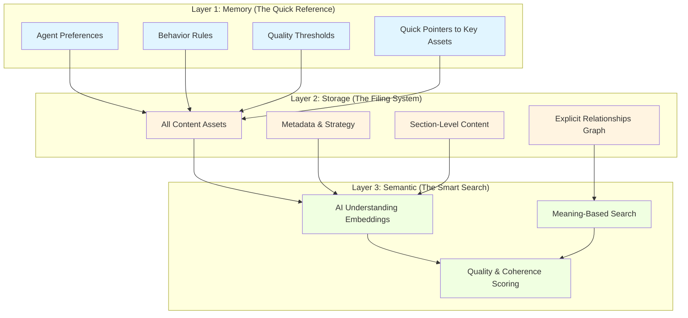
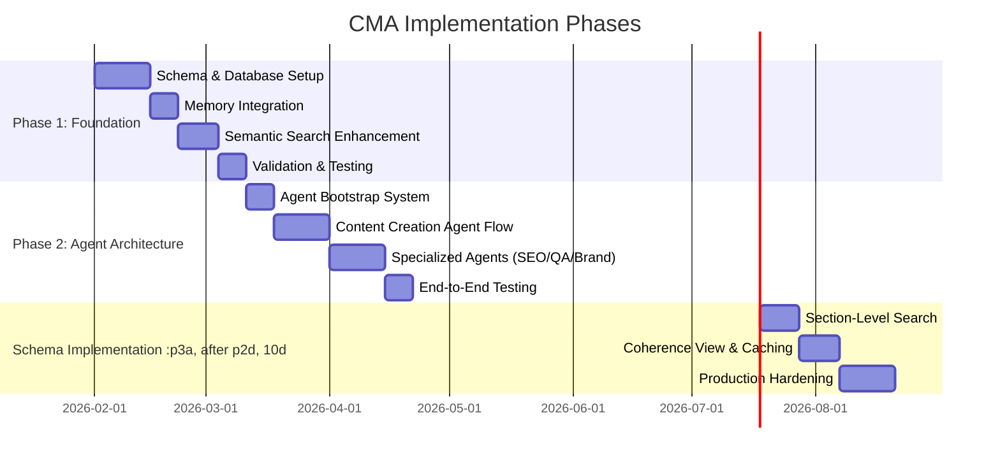
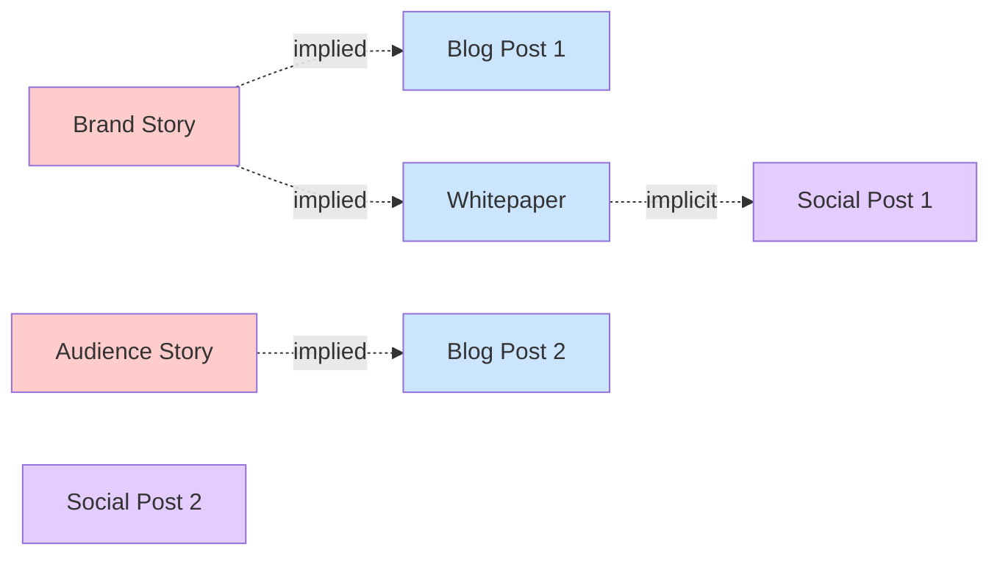
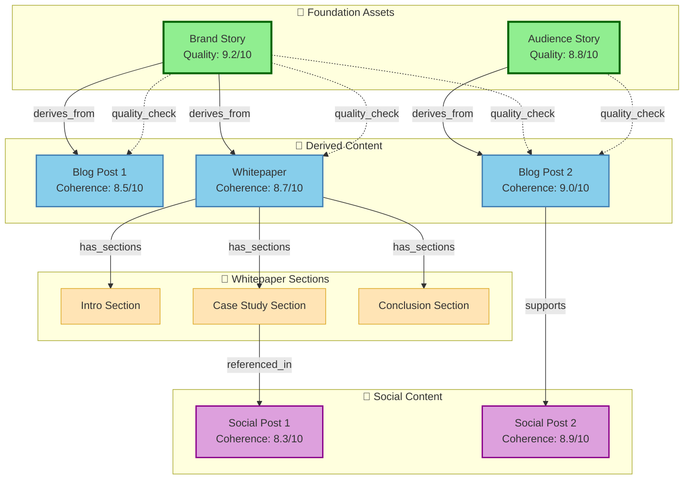

# StoryCycle CMA Implementation: A Layman's Overview

## What is CMA (Cognitive Mesh Architecture)?

Think of CMA as a **smart content brain** for your business. Instead of just storing documents in folders like traditional systems, it creates an intelligent network that:

- **Remembers relationships** between different pieces of content (like how a blog post connects to your brand story)
- **Understands meaning** using AI, not just keywords
- **Maintains consistency** across all your content automatically
- **Helps AI agents create better content** by knowing what's already been created and how it all fits together

### The Key Insight

Most AI tools focus on making tasks faster (efficiency). CMA focuses on making your organization **smarter over time** (intelligence amplification). It's about building organizational knowledge that compounds into competitive advantage - achieving **Return on Intelligence** rather than just Return on Investment.

## Why Does StoryCycle Need This?

StoryCycle already has 38+ different types of content (brand stories, audience stories, social posts, blog articles, strategies, etc.). Right now:

- ❌ These pieces don't explicitly "know" about each other
- ❌ There's no systematic way to track which content derives from which foundation (like your brand story)
- ❌ AI agents have to rediscover relationships every time
- ❌ Long-form content is stored as one big blob, making it hard to reuse individual sections

CMA solves this by creating explicit connections and understanding - turning disconnected content into an intelligent ecosystem.

## The Three-Layer Architecture

CMA works like a three-story building:

### Layer 1: Memory (Lightweight & Fast)
- Small pointers and preferences
- "Which brand story should I use?"
- "What's the minimum quality score I'll accept?"
- Like sticky notes with key information

### Layer 2: Storage (Complete & Structured)
- The full content and all its metadata
- **New addition**: Explicit relationship tracking (e.g., "Blog Post X derives from Brand Story Y")
- **New addition**: Section-level breakdown of long-form content
- Like a well-organized filing cabinet with cross-references

### Layer 3: Semantic (Intelligent Search)
- AI-powered understanding of meaning
- "Find content similar to this theme"
- Coherence scoring (how well does this align with our brand?)
- Like having a librarian who understands context

## The Implementation Journey

The rollout happens in three phases - like building a house:

### Phase 1: Foundation (Build the Infrastructure)

**What happens:**
- Create new database tables for tracking relationships between content
- Set up the semantic search system
- Integrate with the existing memory system
- Test with sample data

**Real-world impact:**
- None yet - this is behind-the-scenes plumbing

**Duration:** ~5-6 weeks

---

### Phase 2: Agent Architecture (Make AI Agents Smart)

**What happens:**
- Agents learn to use the new relationship system
- Content creation agents can now find and reference related content
- Specialized agents (SEO expert, brand consistency checker, QA reviewer) coordinate with each other
- Full testing of multi-agent workflows

**Real-world impact:**
- Agents create more consistent, higher-quality content
- Automatic brand alignment checking
- Better SEO optimization based on related content
- Faster content creation with less revision needed

**Duration:** ~6-7 weeks

---

### Phase 3: Sections & Optimization (Unlock Advanced Features)

**What happens:**
- Break long-form content into searchable, reusable sections
- Enable section-level editing and searching
- Create "coherence view" - a dashboard showing how well everything aligns
- Add caching for speed
- Production security and monitoring

**Real-world impact:**
- Reuse sections from whitepapers in blog posts
- Edit just one chapter without touching the whole document
- See at a glance which content aligns well with your brand story
- Much faster search and content creation

**Duration:** ~6-8 weeks

---

## The Visual Outcome: Before & After

### Before CMA

**Problems:**
- Relationships are implied, not tracked
- No way to find all content derived from a brand story
- Quality/alignment is a manual check
- Sections of long content can't be reused

---

### After CMA

**Benefits:**
- ✅ Explicit relationship tracking
- ✅ Coherence scores show alignment quality
- ✅ Sections are first-class, reusable components
- ✅ Easy to find all content derived from a foundation asset
- ✅ Automatic quality checking against brand standards

---

## How Agents Use CMA: A Real Example

Let's say you ask an agent to create a LinkedIn post about your new product feature.

### Without CMA:
1. Agent asks you: "What's your brand voice?"
2. You copy-paste your brand story
3. Agent creates post
4. You manually check if it aligns
5. Next week, different agent, same questions

### With CMA:
1. Agent initializes from memory → finds your primary brand story automatically
2. Searches semantic layer → finds related posts with high coherence scores
3. Generates new post using brand story as foundation
4. Automatically calculates coherence score (8.7/10)
5. Creates explicit relationship: `new_post derives_from brand_story`
6. Stores post with embedding for future semantic search
7. Next agent automatically has access to this knowledge

**Result:** Faster, more consistent, higher quality - and the system gets smarter with every piece of content.

---

## Success Metrics: How We Know It's Working

| Metric | Target | What It Means |
|--------|--------|---------------|
| **Semantic query latency** | < 200ms | Finding related content is near-instant |
| **Coherence calculation** | < 100ms | Alignment checking happens in real-time |
| **Multi-agent workflow** | < 2s | Three agents working together finish in 2 seconds |
| **Foundation alignment** | > 8.0/10 | All content strongly aligns with brand |
| **Cross-asset connections** | > 5 per asset | Rich relationship network (not isolated pieces) |
| **Cache hit rate** | > 80% | System efficiently reuses knowledge |

---

## The Bottom Line

**CMA transforms StoryCycle from a content creation tool into an intelligent content ecosystem.**

Instead of creating disconnected pieces, you're building a knowledge graph that gets smarter with every asset. AI agents don't just help you write faster - they help you maintain consistency, discover connections, and amplify your organizational intelligence.

This is the shift from **Return on Investment** (saving time) to **Return on Intelligence** (building knowledge that compounds into sustainable competitive advantage).

---

## Quick Reference: Key Terms

- **Semantic Assets**: Your content pieces (brand story, blog posts, etc.) with rich metadata
- **Asset Relationships**: Explicit connections (derives_from, references, supports, contradicts)
- **Coherence Score**: How well content aligns with foundation assets (0-10 scale)
- **Embeddings**: AI-generated numerical representations that capture meaning
- **Section-Level Content**: Breaking long documents into reusable, searchable parts
- **Memory Layer**: Quick-access pointers and rules for agents
- **Strategic Intelligence**: Metadata about depth, risks, decisions, and quality

---

**Document Status:** Overview for stakeholders  
**Last Updated:** February 2026  
**Related Docs:** 
- Technical details: [cma+brightsy-implementation-plan.md](implementation/cma+brightsy-implementation-plan.md)
- Full specification: [cma-authoritative-reference.md](spec/cma-authoritative-reference.md)
